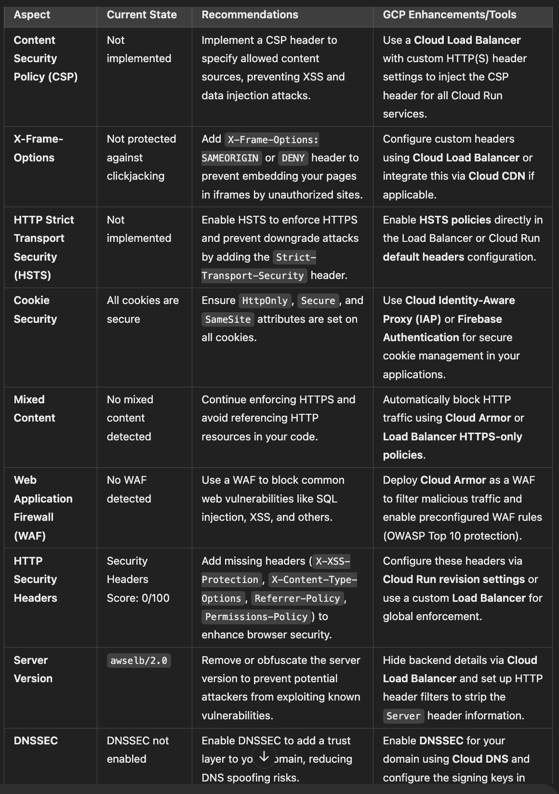

# Node.js concurrency slots per container

* Low-traffic I/O-bound applications: 10-50 slots per container
* Medium-traffic I/O-bound applications: 5-20 slots per container
* High-traffic I/O-bound applications: 2-10 slots per container
* CPU-bound applications: 1-5 slots per container

# Load Balacing security issues.
